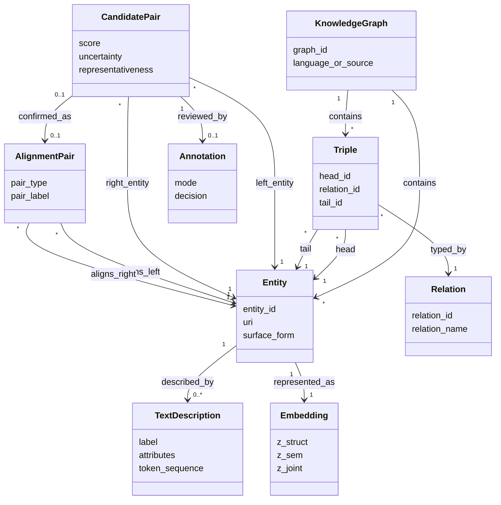

# Самостоятельная работа

## Описание предметной области исследования магистерской работы

**Тема магистерского исследования:** семантическое выравнивание сущностей между кросс-языковыми и гетерогенными графами знаний на основе совместного использования графовых нейронных сетей, многоуровневого Transformer и активного обучения.

**Материалы, на которые опирается данный текст:**  
- [docs/report_translation_zh.md](../docs/report_translation_zh.md)  
- [docs/report_code_consistency_check.md](../docs/report_code_consistency_check.md)  
- [README.md](../README.md)  
- [data_utils.py](../data_utils.py)  
- [train.py](../train.py)

## 1. Описание предметной области

Предметная область исследования связана с интеграцией и семантической совместимостью данных, представленных в виде графов знаний. Граф знаний описывает объекты реального мира в форме сущностей, отношений и атрибутов. В кросс-языковых и гетерогенных сценариях один и тот же объект может быть представлен в разных графах по-разному: под разными именами, на разных языках, с разной степенью полноты описания и с различным окружением связей.

Центральная проблема данной предметной области состоит в том, чтобы определить, какие сущности из двух разных графов знаний соответствуют одному и тому же объекту реального мира. Эта задача называется **выравниванием сущностей** или **entity alignment**. Она имеет практическое значение для интеграции данных, построения объединённых знаний, поиска, аналитики, рекомендательных систем и поддержки научных публикаций, где требуется сопоставлять сущности из разных источников без потери смысла.

В рамках магистерского исследования предметная область сужается до следующего класса задач:

- сопоставление сущностей между двумя графами знаний;
- использование одновременно структурных и семантических признаков;
- работа в условиях ограниченной разметки;
- повышение качества сопоставления за счёт активного обучения.

Таким образом, предметная область включает не только сами графы знаний, но и процесс получения подтверждённых соответствий между сущностями, оценку качества этих соответствий и организацию цикла обратной связи, в котором модель запрашивает наиболее информативные примеры для дополнительной разметки.

## 2. Постановка задачи

Пусть заданы два графа знаний:

- `G1 = (V1, E1)`,
- `G2 = (V2, E2)`,

где `V1` и `V2` являются множествами сущностей, а `E1` и `E2` являются множествами типизированных отношений между сущностями. Для части сущностей известны начальные опорные соответствия. Также для сущностей доступны текстовые признаки: названия, метки, атрибуты, краткие описания или их векторные представления.

Требуется разработать модель, которая:

- строит структурные представления сущностей на основе топологии графа;
- строит семантические представления сущностей на основе текстовой информации;
- объединяет эти представления в общее пространство сопоставления;
- оценивает степень эквивалентности пары сущностей из разных графов;
- формирует множество предсказанных выравниваний;
- при дефиците разметки выбирает наиболее полезные пары для дополнительной проверки.

Формально результатом является множество пар

- `A = {(u, v) | u in V1, v in V2}`,

для которых установлено, что `u` и `v` описывают один и тот же объект реального мира.

### Цель исследования

Разработать метод семантического выравнивания сущностей, который:

- учитывает одновременно структуру графа и текстовую семантику;
- устойчив к языковой и структурной неоднородности источников;
- снижает потребность в ручной разметке;
- обеспечивает более точное ранжирование пар-кандидатов на сопоставление.

### Ограничения текущей реализации в проекте

Чтобы описание соответствовало реальным материалам проекта, важно зафиксировать текущие границы:

- подтверждённый основной экспериментальный сценарий в репозитории: `DBP15K zh_en`, протокол `raw_split / 0_3`;
- в коде также есть загрузчик для наборов `OpenEA`;
- активное обучение поддерживается как часть контура обучения, но в текущем коде может работать в режиме `oracle` или через шаблон для внешней разметки;
- задача рассматривается как сопоставление сущностей между двумя графами, а не как полное слияние онтологий или выравнивание схем в широком смысле.

## 3. Определение существенных терминов

**Граф знаний**  
Структура данных, в которой знания представлены в виде сущностей, отношений и атрибутов, обычно в форме триплетов `(head, relation, tail)`.

**Сущность**  
Объект предметной области, представленный узлом графа знаний. Сущностью может быть человек, организация, место, публикация, понятие и так далее.

**Отношение**  
Типизированная связь между двумя сущностями, задающая смысл взаимодействия между ними.

**Триплет**  
Базовая единица представления знания в графе: субъект, отношение, объект.

**Атрибут / текстовое описание**  
Лексическая или литеральная информация о сущности: имя, метка, описание, атрибутивные значения.

**Кросс-языковой граф знаний**  
Граф знаний, в котором описание сущностей и отношений дано на разных языках либо сопоставляется с графом на другом языке.

**Гетерогенность данных**  
Различия между источниками данных по языку, схеме, полноте, способам именования и структуре связей.

**Выравнивание сущностей**  
Процесс установления соответствия между сущностями разных графов знаний, если они обозначают один и тот же объект реального мира.

**Опорные пары выравнивания**  
Пары эквивалентных сущностей, известные заранее и используемые для обучения или проверки модели.

**Кандидатная пара**  
Пара сущностей из разных графов, для которой модель вычисляет вероятность или степень соответствия.

**Структурное представление**  
Векторное представление сущности, построенное из её окружения в графе: соседей, путей, отношений и топологических признаков.

**Семантическое представление**  
Векторное представление сущности, построенное из текстовых признаков: названий, токенов, фраз и описаний.

**Единое пространство выравнивания**  
Общее векторное пространство, в котором структурные и семантические представления согласуются и используются для сравнения сущностей.

**Активное обучение**  
Подход, при котором модель сама выбирает наиболее информативные примеры для дополнительной разметки, чтобы повысить качество обучения при ограниченном бюджете.

**Неопределённость**  
Мера того, насколько модель не уверена в своём решении по кандидатной паре.

**Репрезентативность**  
Мера того, насколько выбранный объект или пара типичны или информативны для текущего распределения данных.

## 4. Моделирование предметной области

Предметную область удобно описывать через три взаимосвязанных слоя:

### 4.1 Объектный слой

Он включает базовые сущности исследования:

- граф знаний;
- сущность;
- отношение;
- триплет;
- текстовое описание или атрибут;
- пара эквивалентных сущностей.

На этом уровне фиксируется, что каждый граф знаний содержит множество сущностей и множество отношений между ними, а каждая сущность может иметь текстовые признаки.

### 4.2 Слой сопоставления

На этом уровне рассматриваются:

- пары-кандидаты для выравнивания;
- опорные пары;
- предсказанные пары;
- подтверждённые и отклонённые пары.

Смысл этого слоя состоит в том, что из двух графов строится пространство возможных соответствий, а затем модель выделяет среди них наиболее вероятные эквивалентные пары.

### 4.3 Слой обучения и обратной связи

Здесь находятся процессы, а не только объекты:

- построение структурных представлений;
- построение семантических представлений;
- объединение представлений;
- ранжирование кандидатных пар;
- выбор пар для дополнительной разметки;
- возврат новой разметки в обучающую выборку.

Таким образом, предметная область исследования содержит и статические компоненты, и динамический цикл уточнения соответствий.

### 4.4 Основные сущности и их связи

1. **KnowledgeGraph** хранит сущности и триплеты.
2. **Entity** принадлежит одному конкретному графу знаний.
3. **Triple** связывает две сущности через типизированное отношение.
4. **TextDescription** описывает сущность на лексическом уровне.
5. **AlignmentPair** связывает сущность из первого графа с сущностью из второго графа.
6. **CandidatePair** является потенциальным соответствием, для которого вычислен score.
7. **Annotation** фиксирует решение по кандидатной паре: совпадение, несовпадение или пропуск.
8. **Embedding** отражает структурное, семантическое и совместное представление сущности.

### 4.5 Предметные правила

- соответствие устанавливается только между сущностями из разных графов;
- одна и та же сущность не должна подтверждаться как эквивалентная большому числу разных сущностей без дополнительной проверки;
- пара может быть подтверждённой, отрицательной или оставленной без решения;
- текстовые признаки сами по себе недостаточны, если не подтверждаются структурным окружением;
- структурное сходство само по себе недостаточно, если семантика противоречит сопоставлению;
- активное обучение должно выбирать пары не только по неопределённости, но и по полезности для всего пространства данных.

## 5. Концептуальная схема предметной области

### Интерпретация схемы

- **KnowledgeGraph** задаёт контейнер источника знаний.
- **Entity**, **Relation** и **Triple** образуют базовую графовую структуру.
- **TextDescription** представляет семантический слой сущности.
- **Embedding** нужен для перехода от исходных данных к вычислимому пространству сопоставления.
- **CandidatePair** отражает результат работы модели до окончательного подтверждения.
- **Annotation** задаёт внешний сигнал обратной связи.
- **AlignmentPair** фиксирует уже принятое решение о соответствии.

## 6. Отображение исходных данных в концептуальную схему

Ниже показано, как реальные файлы проекта отображаются в элементы концептуальной схемы.

### 6.1 Набор DBP15K в текущем основном сценарии

Текущий подтверждённый базовый сценарий в проекте использует `DBP15K zh_en` и разбиение `0_3`.

| Файл | Элемент схемы | Смысл |
|---|---|---|
| `data/dbp15k/zh_en/0_3/ent_ids_1` | `Entity` в `G1` | идентификаторы и URI сущностей первого графа |
| `data/dbp15k/zh_en/0_3/ent_ids_2` | `Entity` в `G2` | идентификаторы и URI сущностей второго графа |
| `data/dbp15k/zh_en/0_3/triples_1` | `Triple` | связи между сущностями первого графа |
| `data/dbp15k/zh_en/0_3/triples_2` | `Triple` | связи между сущностями второго графа |
| `data/dbp15k/zh_en/0_3/rel_ids_1` | `Relation` | словарь отношений первого графа |
| `data/dbp15k/zh_en/0_3/rel_ids_2` | `Relation` | словарь отношений второго графа |
| `data/dbp15k/zh_en/0_3/sup_rel_ids` | межграфовые соответствия отношений | используется для унификации relation id |
| `data/dbp15k/zh_en/0_3/sup_ent_ids` | `AlignmentPair` типа `seed/train` | опорные положительные пары для обучения |
| `data/dbp15k/zh_en/0_3/ref_ent_ids` | `AlignmentPair` типа `test/reference` | эталонные пары для итоговой оценки |
| `data/dbp15k/zh_en/training_attrs_1`, `training_attrs_2` и PyG-признаки `x1/x2` | `TextDescription` | текстовые и атрибутивные признаки сущностей |

### 6.2 Наборы OpenEA, поддерживаемые в коде

В загрузчике [data_utils.py](../data_utils.py) дополнительно поддерживается семейство `OpenEA`.

| Файл | Элемент схемы | Смысл |
|---|---|---|
| `rel_triples_1`, `rel_triples_2` | `Triple` и `Relation` | реляционная структура двух графов |
| `attr_triples_1`, `attr_triples_2` | `TextDescription` | атрибуты и литералы сущностей |
| `train_links` | `AlignmentPair` типа `train` | обучающие пары соответствий |
| `valid_links` | `AlignmentPair` типа `validation` | валидационные пары |
| `test_links` | `AlignmentPair` типа `test` | тестовые пары |
| `ent_links` | дополнительные известные соответствия | внешние или полные связи между графами |

### 6.3 Отображение на вычислительные представления

В текущем проекте исходные данные переводятся в вычислительную форму следующим образом:

- графовые связи преобразуются в `edge_index` и, при наличии, в `edge_type`;
- текстовые признаки преобразуются в `seq_features`;
- сущности обоих графов переводятся в единое глобальное пространство индексов;
- опорные пары превращаются в `train_pairs`, `val_pairs`, `test_pairs`;
- после кодирования для каждой сущности формируются `z_struct`, `z_sem`, `z_joint`;
- на их основе строятся `CandidatePair` и затем подтверждённые `AlignmentPair`.

## 7. Вывод

Предметная область магистерского исследования представляет собой область семантической интеграции графов знаний, в которой центральной задачей является установление корректных соответствий между сущностями разных источников. Её специфика заключается в одновременном учёте структуры графа, текстовой семантики и ограниченности размеченных данных. Поэтому концептуальная модель должна включать не только графовые объекты и пары соответствий, но и цикл активного уточнения этих соответствий.

В контексте данного проекта наиболее корректно описывать предметную область как задачу **кросс-языкового выравнивания сущностей в графах знаний** с использованием совместного пространства структурных и семантических представлений и с возможностью активного отбора наиболее информативных примеров для доразметки.
